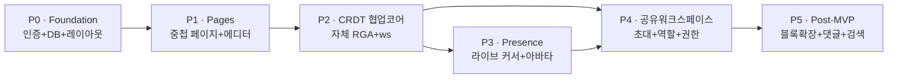

# 03 · MVP 정의 및 로드맵

> **관련 문서**: [제품 개요](01-product-overview.md) · [PRD](02-prd.md) · [아키텍처](04-architecture.md) · [TDD 전략](09-tdd-strategy.md)

---

## 1. MVP 한 줄 목표

> **구글 로그인 → 개인 중첩 페이지 → 실시간 공동편집(자체 RGA CRDT) → Presence → 공유 워크스페이스 초대**

MVP는 P0~P4 다섯 Phase의 합이다. P5 이후는 post-MVP로 분류한다.

---

## 2. MVP 정의 — 가장 작은 출시 가능 슬라이스

| 축 | MVP 포함 | MVP 제외(post-MVP) |
|----|----------|-------------------|
| 인증 | Google OAuth(Auth.js) | 이메일/패스워드, SSO |
| 워크스페이스 | PERSONAL + SHARED(초대·역할) | 게스트 링크, 퍼블릭 페이지 |
| 페이지 | 중첩 트리, CRUD, 자동저장 | 댓글, 반응, 히스토리 diff |
| 에디터 | 텍스트 블록(RGA 기반) | 이미지/코드/테이블/슬래시 명령 |
| 실시간 협업 | 자체 RGA CRDT, ws 동기화, presence | CRDT 스냅샷 압축, 오프라인 모드 |
| 권한 | OWNER / MEMBER (워크스페이스 상속) | Viewer, 페이지별 공유 ACL |
| 초대 | 이메일 초대 토큰, PENDING/ACCEPTED/REVOKED/EXPIRED | 초대 링크, 도메인 화이트리스트 |

---

## 3. Phase별 상세표

### P0 · Foundation

| 항목 | 내용 |
|------|------|
| **목표** | 인증 + 기본 레이아웃 + DB 스키마 기반 확립 |
| **포함 기능** | Google OAuth(Auth.js), User 엔터티, Workspace(PERSONAL) 자동 생성, 사이드바 뼈대, Prisma + PostgreSQL 마이그레이션 |
| **Definition of Done** | ① 구글 계정으로 로그인/로그아웃 가능 ② 로그인 직후 개인 워크스페이스 빈 화면 표시 ③ CI lint + typecheck 통과 |
| **데모 시나리오** | 브라우저에서 "구글로 로그인" 클릭 → OAuth 동의 → 빈 사이드바 화면 도착 |
| **주요 리스크** | Auth.js App Router 세션 설정 오류, Prisma Postgres 연결 환경변수 누락 |
| **예상 난이도** | ★★☆☆☆ |
| **Walking Skeleton** | 로그인 → 홈 리다이렉트 한 줄이 골격; 이후 모든 Phase는 이 인증 흐름 위에 쌓인다 |

---

### P1 · Pages

| 항목 | 내용 |
|------|------|
| **목표** | 단일 사용자가 혼자 쓰는 노션 구현 |
| **포함 기능** | Page CRUD(생성·이름 변경·삭제·이동), parentPageId 자기참조 중첩 트리, 사이드바 트리 렌더링, contenteditable 텍스트 편집 + 디바운스 자동저장, Page 라우팅 `/page/[id]` |
| **Definition of Done** | ① 무제한 중첩 페이지 생성 가능 ② 새로고침 후 내용 보존 ③ 사이드바에서 드래그 없이 트리 탐색 가능 |
| **데모 시나리오** | 로그인 → "새 페이지" 클릭 → 제목 입력 → 하위 페이지 추가 → 내용 타이핑 → 새로고침 → 내용 유지 확인 |
| **주요 리스크** | 트리 순서(order) 충돌 — 동시 insert 없이도 parentPageId + order 필드 설계가 나중 P4와 충돌할 수 있음 |
| **예상 난이도** | ★★★☆☆ |
| **Walking Skeleton** | 페이지 하나 생성 + 저장 + 조회 API가 골격; 중첩·드래그는 그 위에 적층 |

---

### P2 · CRDT 협업 코어

| 항목 | 내용 |
|------|------|
| **목표** | 자체 RGA CRDT + ws 실시간 서버로 2탭 수렴 |
| **포함 기능** | 자체 RGA 구현(Insert/Delete/tombstone/tie-break/인과 버퍼), 별도 Node+ws 서버, 클라이언트 op 생성·전송·적용, CrdtOp append-only 저장, Snapshot 기반 초기 로드, 재접속 시 missing op 재전송 |
| **Definition of Done** | ① 두 브라우저 탭에서 동시 편집 후 텍스트 수렴 ② 네트워크 끊김 후 재접속 시 손실 없음 ③ property-based 테스트 수렴·멱등·교환법칙 통과 |
| **데모 시나리오** | 탭 A와 탭 B에서 같은 페이지 열기 → 동시에 다른 위치 타이핑 → 양쪽 동일 결과 수렴 확인 |
| **주요 리스크** | **RGA tie-break 버그** — 결정적 순서 보장 실패 시 영구 불일치; 인과 버퍼링 누락 시 순서 역전 |
| **예상 난이도** | ★★★★★ (프로젝트 최고 난이도) |
| **Walking Skeleton** | 단일 Insert op 생성 → ws 전송 → 서버 브로드캐스트 → 수신 탭 적용; 이것이 동작한 뒤 Delete·동시성 처리 추가 |

---

### P3 · Presence

| 항목 | 내용 |
|------|------|
| **목표** | 노션식 presence — 누가 어디를 보고 있는지 실시간 표시 |
| **포함 기능** | 라이브 커서(문자 id 앵커), 아바타 목록("이 페이지 보는 중"), 커서 색상 할당, presence 비영속(ws 연결 수명), 연결/해제 이벤트 브로드캐스트 |
| **Definition of Done** | ① 두 탭에서 각자 커서가 상대방 화면에 표시 ② 탭 닫으면 아바타 사라짐 ③ RGA 문자 id 앵커 유지(텍스트 삽입 후 커서 위치 보정) |
| **데모 시나리오** | 탭 A 사용자가 타이핑 중 탭 B 화면에 A의 커서와 아바타 실시간 표시 |
| **주요 리스크** | **커서 앵커링** — RGA tombstone 삭제 후 앵커 문자가 사라지면 커서 위치 소실 |
| **예상 난이도** | ★★★★☆ |
| **Walking Skeleton** | ws join/leave 이벤트 → 아바타 목록 표시; 커서 좌표 전송은 그 위에 적층 |

---

### P4 · 공유 워크스페이스

| 항목 | 내용 |
|------|------|
| **목표** | 팀 협업 — 워크스페이스 생성·초대·역할·권한 |
| **포함 기능** | SHARED Workspace 생성, 이메일 초대(Invitation 토큰, PENDING→ACCEPTED/REVOKED/EXPIRED), OWNER/MEMBER 역할, 멤버십 기반 페이지 접근 제어, 멤버 목록 관리(OWNER만 초대·추방) |
| **Definition of Done** | ① OWNER가 이메일 초대 → MEMBER가 수락 → 공유 워크스페이스 내 페이지 편집 가능 ② 추방된 멤버는 즉시 접근 차단 ③ MEMBER가 초대 불가 |
| **데모 시나리오** | 사용자 A가 공유 워크스페이스 생성 → 사용자 B 초대 이메일 발송 → B가 수락 → 양쪽 실시간 공동편집 |
| **주요 리스크** | 초대 토큰 만료 처리(EXPIRED), 추방 즉시 ws 세션 강제 종료 |
| **예상 난이도** | ★★★☆☆ |
| **Walking Skeleton** | 워크스페이스 생성 → 멤버 목록 표시; 초대 플로는 그 위에 추가 |

---

### P5 · Post-MVP

| 항목 | 내용 |
|------|------|
| **목표** | 에디터 풍부화 + 편의 기능 |
| **포함 기능** | 블록 타입 확장(헤딩/체크리스트/코드/이미지), 슬래시 명령, 페이지별 공유 ACL, Viewer 역할, 댓글/반응, 전문 검색, CRDT Snapshot 압축, 오프라인 모드 |
| **Definition of Done** | 각 기능 단위 릴리스 기준으로 별도 정의 |
| **데모 시나리오** | 기능별 시연 |
| **주요 리스크** | 텍스트 RGA → 블록 RGA 마이그레이션 복잡도 |
| **예상 난이도** | ★★★☆☆ ~ ★★★★☆ (기능별 차등) |
| **Walking Skeleton** | P2 텍스트 RGA를 블록 단위로 감싸는 래퍼 레이어 설계가 핵심 |

---

## 4. Phase 의존성 그래프

**핵심 선행 관계 설명**

| 선행 Phase | 후행 Phase | 이유 |
|-----------|-----------|------|
| P0 | P1 | 인증/DB 없이 페이지 저장 불가 |
| P1 | P2 | 에디터 DOM 구조 없이 CRDT 적용 불가 |
| P2 | P3 | ws 연결 인프라 없이 presence 전송 불가 |
| P2 | P4 | CRDT op 브로드캐스트 없이 팀 편집 불가 |
| P3 | P4 | P4 데모에서 presence 포함이 필수 |
| P4 | P5 | 권한 모델 확정 후 페이지별 ACL 추가 |

---

## 5. 리스크 레지스터

| ID | 리스크 | Phase | 심각도 | 완화책 |
|----|--------|-------|--------|--------|
| R01 | **RGA tie-break 비결정적** — 동시 삽입 순서가 사이트마다 다르면 영구 불일치 | P2 | 치명 | property-based 테스트(fast-check)로 모든 op 순서 조합 검증; id 비교 로직(counter desc → siteId)을 순수 함수로 분리 후 단위 테스트 선행 |
| R02 | **인과 버퍼링 누락** — originId 미도착 op 즉시 적용 시 순서 역전 | P2 | 치명 | 버퍼 자료구조(pendingOps Map) TDD로 선구현; 도착 op마다 의존성 해소 루프 강제 |
| R03 | **커서 앵커 소실** — tombstone 문자에 앵커된 커서가 렌더 불가 | P3 | 높음 | 앵커 문자 삭제 시 "다음 살아있는 문자"로 폴백하는 로직 명시, 테스트 픽스처 추가 |
| R04 | **재접속 후 op 갭** — 오프라인 기간 op 손실 | P2 | 높음 | CrdtOp append-only + 클라이언트 lastSeq로 missing op 재전송; 재접속 e2e 테스트 |
| R05 | **ws 서버 단일 장애점** — Node ws 프로세스 크래시 | P2+ | 중간 | MVP에서는 단순 재시작 허용(문서화), post-MVP에서 Redis Pub/Sub 클러스터 전환 |
| R06 | **초대 토큰 만료 처리** — EXPIRED 상태 미전환으로 보안 홀 | P4 | 중간 | Invitation 생성 시 expiresAt 설정, 수락 시점에 서버에서 만료 검증, 토큰 단위 테스트 |
| R07 | **텍스트 RGA → 블록 RGA 마이그레이션** — P5에서 데이터 구조 변경 | P5 | 낮음(MVP 후) | P2 설계 시 블록 래퍼 고려한 인터페이스 설계; MVP 완료 후 마이그레이션 스크립트 |
| R08 | **contenteditable 상태 동기화** — React 상태와 DOM 커서 충돌 | P1+ | 중간 | 에디터 레이어를 uncontrolled로 유지, React 외부에서 커서 관리; P2 CRDT 적용 전 P1에서 패턴 확정 |

---

## 6. Walking Skeleton 관점 권고 (Phase별)

Walking Skeleton = "얇지만 전체 레이어를 관통하는 최소 구현체". 각 Phase의 골격을 먼저 동작시키고 살을 붙인다.

| Phase | 골격 | 살(후속 구현) |
|-------|------|--------------|
| **P0** | 구글 로그인 → DB User 생성 → `/` 리다이렉트 | 세션 갱신, 로그아웃, 에러 페이지 |
| **P1** | 페이지 1개 생성 → Route Handler 저장 → 새로고침 후 표시 | 중첩 트리, 삭제, 이동, 사이드바 애니메이션 |
| **P2** | Insert op 1개 → ws 전송 → 수신 탭 적용 (단일 문자) | Delete, 동시 삽입, 인과 버퍼, 재접속, 스냅샷 |
| **P3** | 탭 join/leave 이벤트 → 아바타 목록 갱신 | 커서 좌표 전송, 앵커링, 색상 할당 |
| **P4** | 공유 워크스페이스 생성 → 멤버 목록 표시 | 초대 이메일, 토큰 수락, 추방, 권한 미들웨어 |
| **P5** | 슬래시 명령 파서 1개 (헤딩 변환) | 나머지 블록 타입, 검색, 댓글 |

---

---

## 7. 차별화 기능 통합

> 전략 전문은 [10-differentiation.md](./10-differentiation.md) 참고. 여기서는 각 Phase에 어느 차별점이 붙는지만 정리한다.

### 차별점 → Phase 매핑

| 차별점 | 분류 | Phase | 비고 |
|--------|------|-------|------|
| 편집에도 안 깨지는 앵커 | 아키텍처 | **P3** | presence 커서 앵커링에 내재 — 별도 작업 없음 |
| 로컬 우선·오프라인 편집 | 아키텍처 | **P2-P3 연장 / P5+** | P2 CRDT 코어 위에 op 큐 + IndexedDB 추가; 완전한 local-first 영속화는 post-MVP |
| 타임머신 버전 히스토리 | 아키텍처 | **P5** | op 로그는 P2부터 쌓임. "데이터는 공짜, UI는 후순위" |
| 작성 타임랩스 리플레이 | 협업 UX | **P5** | 타임머신 위에 구현. 가장 강력한 바이럴 후크 |
| 관전 모드(Follow) | 협업 UX | **P3 확장 또는 P5** | presence 메시지에 뷰포트 위치 추가 |
| 블록 단위 presence 히트맵 | 협업 UX | **P3 확장 또는 P5** | 커서 앵커 → 블록 매핑 UI 레이어 |
| 문서 브랜치 & 머지 | 아키텍처 | **P5+** | CRDT 병합은 지원, UI/UX 설계 별도 필요 |

### Phase별 차별화 연결 요약

- **P2 · CRDT 협업 코어** — append-only op 로그 축적 시작. 타임머신·타임랩스의 **데이터 기반**이 이때 만들어진다.
- **P3 · Presence** — RGA 문자 id 커서 앵커링 구현. **안 깨지는 앵커**가 이 Phase에서 자동 완성된다. 관전 모드·히트맵의 기반 인프라.
- **P4 · 공유 워크스페이스** — 오프라인 op 큐 설계를 고려한 재접속 로직 확정. 로컬 우선 영속화 설계의 전 단계.
- **P5 · Post-MVP** — 타임머신 UI, 타임랩스 리플레이, 완전한 오프라인 local-first(IndexedDB), 관전 모드, 브랜치·머지 순으로 우선순위화.

---

*최종 수정: 2026-06-18 | 다음 문서: [04-architecture.md](04-architecture.md)*
