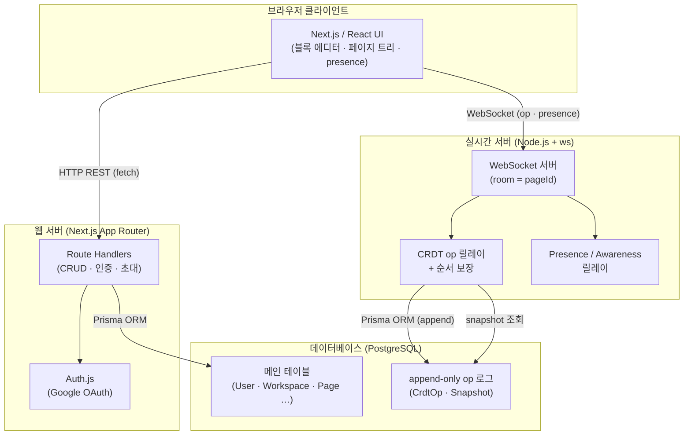
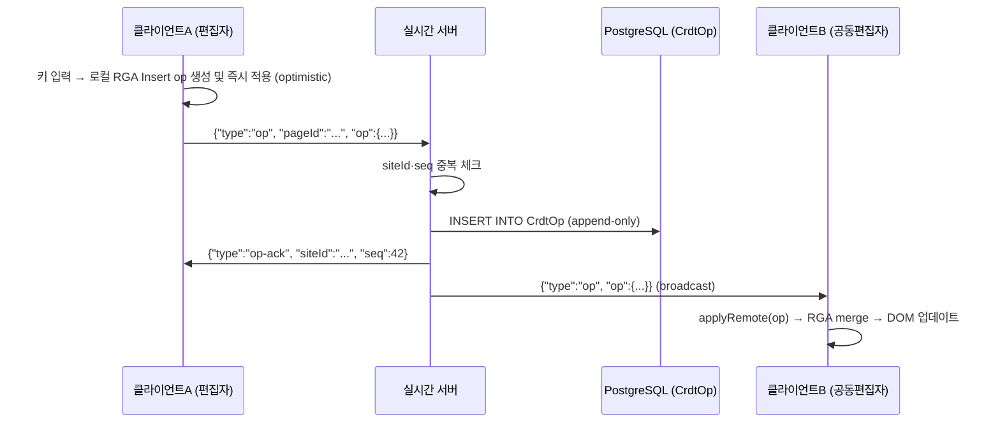
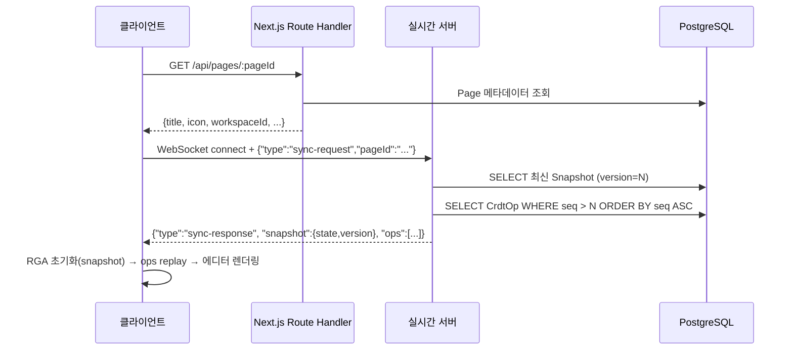
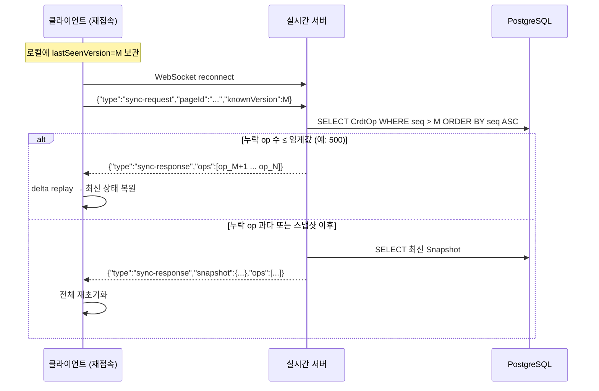

# 04. 아키텍처 설계

> **관련 문서**: [제품 개요](./01-product-overview.md) · [PRD](./02-prd.md) · [로드맵](./03-mvp-and-roadmap.md) · [데이터 모델](./05-data-model.md) · [API & 실시간](./06-api-and-realtime.md) · [CRDT 협업](./07-collaboration-crdt.md) · [인증 & 권한](./08-auth-and-permissions.md) · [TDD 전략](./09-tdd-strategy.md)

---

## 1. 시스템 전체 구조 개요



### 왜 CRUD 서버와 실시간 서버를 분리하는가?

| 관점 | HTTP CRUD (Next.js Route Handler) | 실시간 서버 (Node.js + ws) |
|------|-----------------------------------|---------------------------|
| **연결 특성** | 무상태(stateless) · 요청-응답 | 상태 유지(stateful) · 지속 연결 |
| **배포 모델** | Vercel 등 서버리스 가능 · 수평 확장 용이 | 프로세스 상주 필수 · Railway / Fly.io |
| **책임 범위** | 인증 · 워크스페이스 · 페이지 메타 · 초대 | op 릴레이 · 순서 · 영속화 · presence |
| **장애 격리** | CRUD 다운 시 실시간 편집 계속 가능 | ws 다운 시 REST 기능 유지 |
| **스케일링** | 무상태이므로 인스턴스 무제한 추가 | room 친화적 sticky session or pub/sub |

> **결론**: CRDT 릴레이는 room 상태(현재 접속자 · op 버퍼)를 메모리에 유지해야 한다. 이를 서버리스 환경에 억지로 올리면 cold-start와 메모리 공유 문제가 발생한다. 분리함으로써 각 서버가 자신의 최적 인프라에서 동작한다.

---

## 2. 컴포넌트별 책임

### 2-1. 클라이언트 (`apps/web` — 브라우저)

| 모듈 | 책임 |
|------|------|
| **블록 에디터** (`editor/`) | in-house contenteditable 에디터, 로컬 RGA CRDT 인스턴스 보유, 타이핑 → op 생성 → ws 전송 |
| **페이지 트리** (`sidebar/`) | 중첩 페이지 목록 렌더링, 드래그-드롭 이동, 아카이브 |
| **Presence UI** (`presence/`) | 다른 편집자 커서(문자 id 앵커 기반) · 색상 오버레이 표시 |
| **워크스페이스 관리** (`workspace/`) | 생성 · 초대 · 멤버 목록 UI |
| **인증 흐름** | Auth.js 세션 쿠키 자동 첨부, Google OAuth 리다이렉트 처리 |

### 2-2. 웹 API 서버 (`apps/web` — Next.js Route Handlers)

| 영역 | 책임 |
|------|------|
| **인증** | Auth.js Google OAuth 콜백, 세션 검증 미들웨어 |
| **워크스페이스** | 개인 워크스페이스 자동 생성, 공유 워크스페이스 CRUD, 멤버십 조회 |
| **초대** | 이메일 초대 토큰 발급, 수락/취소, 역할 할당 |
| **페이지** | 생성 · 조회 · 이름 변경 · 이동(parentPageId · position) · 아카이브 · 트리 조회 |
| **권한 검사** | 모든 Route Handler에서 Membership 조회 → OWNER/MEMBER 검증 |

### 2-3. 실시간 서버 (`apps/realtime`)

| 영역 | 책임 |
|------|------|
| **Room 관리** | `room = pageId`, 클라이언트 join/leave 추적 |
| **op 릴레이** | 수신 op → DB append(CrdtOp) → 같은 room의 다른 클라이언트에게 브로드캐스트 |
| **순서 보장** | site별 seq 단조 증가 검증, 중복 op 무시 |
| **초기 동기화** | `sync-request` 수신 시 최신 Snapshot + 이후 CrdtOp 목록을 응답 |
| **Presence 릴레이** | `awareness` 메시지 수신 → 같은 room 브로드캐스트(비영속) |
| **인증** | 연결 시 Auth.js 세션 쿠키 or JWT 토큰 검증 |

### 2-4. 데이터베이스 (PostgreSQL + Prisma)

| 영역 | 책임 |
|------|------|
| **메인 스키마** | User · Workspace · Membership · Invitation · Page (상세 → [05-data-model.md](./05-data-model.md)) |
| **CrdtOp** | append-only op 로그(pageId, siteId, seq, opType, payload) |
| **Snapshot** | 주기적 RGA 상태 스냅샷(version = op 총 개수), 재생 시작점 |

---

## 3. 핵심 데이터 흐름

### 3-1. 타이핑 → 원격 반영



### 3-2. 페이지 열기 → 초기 상태 로드



### 3-3. 재접속 동기화



---

## 4. 모노레포 폴더 구조

```
mosaic/                          ← 레포 루트
├── apps/
│   ├── web/                     ← Next.js App Router (CRUD + UI)
│   │   ├── app/
│   │   │   ├── (auth)/          ← 로그인·OAuth 콜백
│   │   │   ├── (app)/           ← 인증 필요 라우트
│   │   │   │   ├── workspace/
│   │   │   │   └── page/[pageId]/
│   │   │   └── api/             ← Route Handlers
│   │   │       ├── auth/        ← Auth.js 핸들러
│   │   │       ├── workspaces/
│   │   │       ├── pages/
│   │   │       └── invitations/
│   │   └── components/
│   │       ├── editor/          ← 블록 에디터 UI
│   │       ├── sidebar/         ← 페이지 트리
│   │       └── presence/        ← 커서 오버레이
│   └── realtime/                ← Node.js + ws 실시간 서버
│       ├── src/
│       │   ├── server.ts        ← ws 서버 진입점
│       │   ├── room-manager.ts  ← room 생명주기
│       │   ├── op-handler.ts    ← op 수신·검증·릴레이·영속화
│       │   ├── presence.ts      ← awareness 릴레이
│       │   └── auth.ts          ← 연결 시 토큰 검증
│       └── tests/
├── packages/
│   ├── crdt/                    ← ★ 순수 TypeScript RGA CRDT
│   │   ├── src/
│   │   │   ├── rga.ts           ← RGA 핵심 알고리즘
│   │   │   ├── op.ts            ← op 타입 정의
│   │   │   └── index.ts
│   │   └── tests/               ← Vitest 단위 테스트 (TDD 핵심)
│   └── db/                      ← Prisma 스키마 + 클라이언트
│       ├── prisma/
│       │   └── schema.prisma
│       └── src/
│           └── index.ts         ← PrismaClient 싱글턴 export
├── package.json                 ← pnpm workspace 설정
└── turbo.json                   ← Turborepo 빌드 파이프라인
```

> **`packages/crdt` 중요성**: Node.js · 브라우저 환경 모두에서 동작하는 **외부 의존성 없는 순수 TypeScript** 패키지. DOM, Prisma, ws 등 어떤 I/O 의존성도 갖지 않으므로 Vitest 단위 테스트가 극도로 빠르고 신뢰할 수 있다. TDD의 핵심 대상이며, `apps/web`과 `apps/realtime` 양쪽에서 동일 패키지를 임포트하여 클라이언트-서버 간 CRDT 로직 일관성을 보장한다. 자세한 내용은 [07-collaboration-crdt.md](./07-collaboration-crdt.md) 및 [09-tdd-strategy.md](./09-tdd-strategy.md) 참조.

---

## 5. 기술 선택 근거

| 기술 | 선택 근거 | 주요 대안 | 트레이드오프 |
|------|-----------|-----------|-------------|
| **Next.js App Router** | 풀스택 단일 레포, RSC로 초기 렌더 성능, Vercel 1st-class 지원 | Remix, SvelteKit | 번들 복잡도 ↑, App Router 학습 곡선 |
| **Auth.js (Google OAuth)** | Next.js 공식 인증 라이브러리, 세션 쿠키 관리 자동화 | NextAuth v4, Clerk, custom JWT | Clerk은 유료 SaaS 의존, custom JWT는 구현 비용 |
| **PostgreSQL + Prisma** | ACID 보장, CrdtOp append-only 패턴에 적합, Prisma 타입 안전 쿼리 | MySQL, MongoDB, Supabase | NoSQL은 ACID 보장 어려움; Supabase는 벤더 종속 |
| **자체 RGA CRDT** | Yjs 블랙박스 없이 알고리즘 완전 이해·제어, TDD 가능, 학습 목적 | Yjs, Automerge | 구현 난이도 ↑, Yjs 대비 생태계 없음 |
| **별도 Node.js ws 서버** | 상태 유지 room 관리, 서버리스 제약 없음 | Socket.io, Liveblocks | Socket.io는 오버헤드, Liveblocks는 유료 SaaS |
| **Tailwind CSS** | 유틸리티 퍼스트로 빠른 스타일링, 번들 크기 최소화 | CSS Modules, styled-components | 클래스명 장황, 디자인 시스템 추상화 필요 시 추가 작업 |
| **Vitest + Playwright** | Vitest는 ESM 네이티브·빠른 단위 테스트, Playwright는 크로스 브라우저 E2E | Jest + Cypress | Jest는 ESM 설정 복잡, Cypress는 싱글 브라우저 |
| **Turborepo** | 모노레포 태스크 캐싱, `packages/crdt` 선행 빌드 자동화 | Nx, 단순 pnpm workspace | Nx 대비 설정 단순, 기능은 다소 적음 |

---

## 6. 확장성 · 장애 · 보안 고려

### 확장성
- **수평 확장**: Next.js 서버는 무상태이므로 Vercel 자동 스케일링.
- **ws 서버 스케일링 (post-MVP)**: 단일 인스턴스로 MVP 충분. 다중 인스턴스 시 Redis pub/sub으로 room 간 op 브로드캐스트 공유.
- **Snapshot 전략**: CrdtOp가 일정 수 이상 누적되면 비동기 백그라운드 작업으로 Snapshot 생성 → 재접속 재생 비용 O(1).

### 장애 처리
- **ws 연결 끊김**: 클라이언트는 exponential backoff로 재접속, `knownVersion`으로 delta 동기화.
- **op 영속화 실패**: DB write 실패 시 클라이언트에게 `op-ack` 미전송 → 클라이언트는 타임아웃 후 재전송.
- **서버 재시작**: room 상태는 DB에서 재구성 가능. 메모리 상태 유실은 첫 클라이언트 `sync-request`로 복원.

### 보안
- **인증**: 모든 Route Handler에서 `auth()` 세션 검증. ws 연결 시 세션 쿠키 또는 서명된 단기 토큰 검증.
- **권한**: 페이지 접근 = Membership 레코드 존재 여부 확인. OWNER 전용 작업(초대, 워크스페이스 삭제) 역할 확인.
- **초대 토큰**: UUID v4, 만료시간(expiresAt) 적용, 수락 후 즉시 status=ACCEPTED로 소비.
- **CORS**: ws 서버는 Next.js 앱 오리진만 허용.
- **입력 검증**: Zod 스키마로 모든 Route Handler 입력 검증.

---

> 다음: [05-data-model.md](./05-data-model.md) — 엔티티 스키마 상세 / [06-api-and-realtime.md](./06-api-and-realtime.md) — API 엔드포인트 및 WebSocket 프로토콜
