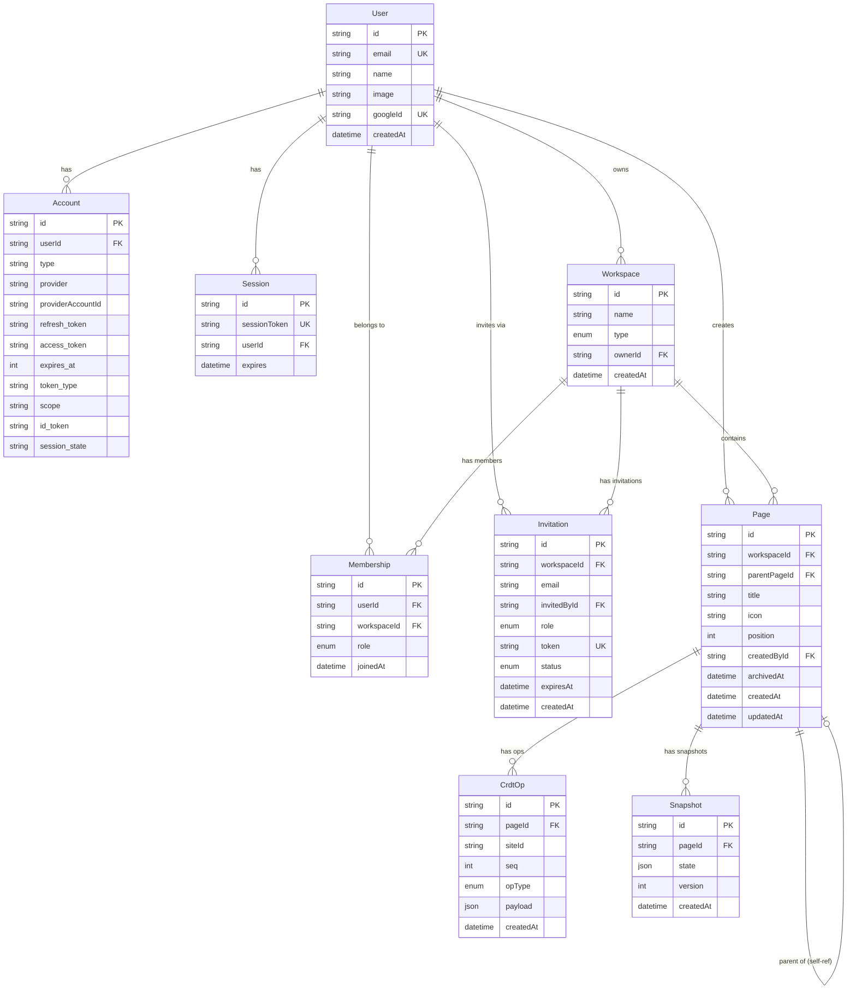

# 05. 데이터 모델

> 관련 문서: [README](./README.md) · [01 제품 개요](./01-product-overview.md) · [04 아키텍처](./04-architecture.md) · [06 API & 실시간](./06-api-and-realtime.md) · [07 협업 CRDT](./07-collaboration-crdt.md) · [08 인증 & 권한](./08-auth-and-permissions.md)

---

## 1. ERD (Entity-Relationship Diagram)



---

## 2. 엔티티 상세 명세

### 2.1 User

| 필드 | 타입 | 제약 | 설명 |
|------|------|------|------|
| `id` | `String` | PK, `cuid()` | 내부 식별자 |
| `email` | `String` | UNIQUE, NOT NULL | 구글 계정 이메일 |
| `name` | `String?` | nullable | 표시 이름 |
| `image` | `String?` | nullable | 프로필 이미지 URL |
| `googleId` | `String?` | UNIQUE | 구글 OAuth sub 값 |
| `createdAt` | `DateTime` | DEFAULT now() | 가입 일시 |

**인덱스:** `email`, `googleId` (Auth.js 어댑터 조회 최적화)

---

### 2.2 Workspace

| 필드 | 타입 | 제약 | 설명 |
|------|------|------|------|
| `id` | `String` | PK, `cuid()` | 내부 식별자 |
| `name` | `String` | NOT NULL | 워크스페이스 표시 이름 |
| `type` | `WorkspaceType` | NOT NULL | `PERSONAL` \| `SHARED` |
| `ownerId` | `String` | FK → User.id | 생성자(소유자) |
| `createdAt` | `DateTime` | DEFAULT now() | 생성 일시 |

**인덱스:** `ownerId`

> `PERSONAL` 타입은 회원 가입 시 자동으로 1개 생성된다. 자세한 규칙은 [§4.1](#41-개인-워크스페이스-자동-생성) 참고.

---

### 2.3 Membership

| 필드 | 타입 | 제약 | 설명 |
|------|------|------|------|
| `id` | `String` | PK, `cuid()` | 내부 식별자 |
| `userId` | `String` | FK → User.id | 멤버 |
| `workspaceId` | `String` | FK → Workspace.id | 대상 워크스페이스 |
| `role` | `MemberRole` | NOT NULL | `OWNER` \| `MEMBER` |
| `joinedAt` | `DateTime` | DEFAULT now() | 참여 일시 |

**유니크 제약:** `(userId, workspaceId)` — 중복 멤버십 방지  
**인덱스:** `workspaceId`, `userId`

> `OWNER` 역할은 워크스페이스 **관리자**(admin)다. 멤버 초대·멤버 제거·역할 변경·워크스페이스 삭제 권한을 가진다.  
> `MEMBER` 역할은 페이지 생성·편집 권한을 가진다.  
> `Viewer` 역할은 post-MVP 로드맵에 포함된다.

---

### 2.4 Invitation

| 필드 | 타입 | 제약 | 설명 |
|------|------|------|------|
| `id` | `String` | PK, `cuid()` | 내부 식별자 |
| `workspaceId` | `String` | FK → Workspace.id | 초대 대상 워크스페이스 |
| `email` | `String` | NOT NULL | 초대받는 이메일 |
| `invitedById` | `String` | FK → User.id | 초대한 사용자 |
| `role` | `MemberRole` | NOT NULL | 초대 후 부여될 역할 |
| `token` | `String` | UNIQUE, `uuid()` | 수락 링크 토큰 |
| `status` | `InvitationStatus` | DEFAULT `PENDING` | `PENDING` \| `ACCEPTED` \| `REVOKED` \| `EXPIRED` |
| `expiresAt` | `DateTime` | NOT NULL | 토큰 만료 일시 (기본 7일) |
| `createdAt` | `DateTime` | DEFAULT now() | 초대 생성 일시 |

**유니크 제약:** `token`  
**인덱스:** `workspaceId`, `email`, `token`

---

### 2.5 Page

| 필드 | 타입 | 제약 | 설명 |
|------|------|------|------|
| `id` | `String` | PK, `cuid()` | 내부 식별자 |
| `workspaceId` | `String` | FK → Workspace.id | 소속 워크스페이스 |
| `parentPageId` | `String?` | FK → Page.id (자기참조) | 부모 페이지, null이면 루트 |
| `title` | `String` | DEFAULT `""` | 페이지 제목 |
| `icon` | `String?` | nullable | 이모지 또는 이미지 URL |
| `position` | `Int` | NOT NULL | 같은 부모 내 정렬 순서 |
| `createdById` | `String` | FK → User.id | 생성자 |
| `archivedAt` | `DateTime?` | nullable | soft delete 타임스탬프 |
| `createdAt` | `DateTime` | DEFAULT now() | 생성 일시 |
| `updatedAt` | `DateTime` | @updatedAt | 최종 수정 일시 |

**인덱스:**
- `(workspaceId, parentPageId, position)` — 페이지 트리 탐색 + 정렬
- `workspaceId`
- `createdById`
- `archivedAt` — 아카이브 필터링

---

### 2.6 CrdtOp

| 필드 | 타입 | 제약 | 설명 |
|------|------|------|------|
| `id` | `String` | PK, `cuid()` | 내부 식별자 |
| `pageId` | `String` | FK → Page.id | 소속 페이지 |
| `siteId` | `String` | NOT NULL | 편집 클라이언트 식별자 (UUID per session) |
| `seq` | `Int` | NOT NULL | 해당 siteId 내 단조 증가 시퀀스 번호 |
| `opType` | `OpType` | NOT NULL | `INSERT` \| `DELETE` |
| `payload` | `Json` | NOT NULL | RGA op 상세 (하단 §5 참고) |
| `createdAt` | `DateTime` | DEFAULT now() | 서버 수신 일시 |

**유니크 제약:** `(pageId, siteId, seq)` — 중복 op 방지  
**인덱스:** `(pageId, siteId, seq)`, `pageId`

> append-only 테이블. 행을 수정하거나 삭제하지 않는다. Snapshot 이전 op 정리는 별도 archival 전략으로 처리한다(§5.3).

---

### 2.7 Snapshot

| 필드 | 타입 | 제약 | 설명 |
|------|------|------|------|
| `id` | `String` | PK, `cuid()` | 내부 식별자 |
| `pageId` | `String` | FK → Page.id | 대상 페이지 |
| `state` | `Json` | NOT NULL | RGA 상태 직렬화 (전체 문서 트리) |
| `version` | `Int` | NOT NULL | 스냅샷 생성 시점의 최대 seq |
| `createdAt` | `DateTime` | DEFAULT now() | 생성 일시 |

**인덱스:** `(pageId, version DESC)` — 최신 스냅샷 빠른 조회

---

### 2.8 Auth.js 어댑터 테이블 (Account / Session)

Auth.js Prisma Adapter가 요구하는 표준 스키마를 그대로 사용한다. 커스텀 변경 없이 공식 어댑터 DDL을 따른다.

| 테이블 | 용도 |
|--------|------|
| `Account` | OAuth 공급자 토큰 저장 (구글 access/refresh token) |
| `Session` | 서버-사이드 세션 (Auth.js database strategy) |
| `VerificationToken` | 이메일 인증 토큰 (현재 미사용, 스키마에 포함) |

---

## 3. 관계 설명

### 3.1 User ↔ Workspace (개인 vs. 공유)

- **개인 워크스페이스:** `Workspace.type = PERSONAL`. `ownerId`가 해당 User를 직접 가리키며, 사실상 1:1 관계다. Membership 레코드도 함께 생성된다(`role = OWNER`).
- **공유 워크스페이스:** `Workspace.type = SHARED`. N:M 관계는 `Membership` 테이블로 표현한다. 워크스페이스 생성자는 자동으로 `OWNER` Membership을 부여받는다.

### 3.2 Page 트리 (자기참조)

```
Workspace
└── Page A (parentPageId = null, position = 1000)
    ├── Page B (parentPageId = A.id, position = 1000)
    │   └── Page D (parentPageId = B.id, position = 1000)
    └── Page C (parentPageId = A.id, position = 2000)
```

- `parentPageId = null`이면 워크스페이스의 루트 페이지.
- 같은 부모를 공유하는 페이지들은 `position`으로 정렬된다.
- 페이지 이동 시 `workspaceId`와 `parentPageId`를 함께 업데이트한다.

### 3.3 Workspace → Page

한 워크스페이스의 모든 페이지는 `Page.workspaceId`로 귀속된다. 페이지 접근 권한은 워크스페이스 Membership에서 상속된다(MVP). 페이지별 세분화 권한은 post-MVP.

### 3.4 Page → CrdtOp / Snapshot

- 페이지 콘텐츠는 `CrdtOp` 로그의 누적 적용 결과다.
- `Snapshot`은 특정 시점의 완전한 상태를 저장하여 재생(replay) 비용을 줄인다.
- 로드 시: 가장 최신 `Snapshot`을 기준으로 그 이후 `CrdtOp`만 replay한다.

---

## 4. 운영 정책

### 4.1 개인 워크스페이스 자동 생성

사용자 최초 가입(Google OAuth 콜백 완료) 시점에 트랜잭션으로 처리한다.

```
BEGIN TRANSACTION
  1. User 레코드 생성 (또는 조회)
  2. Workspace 생성: { type: PERSONAL, name: "{name}의 워크스페이스", ownerId: user.id }
  3. Membership 생성: { userId: user.id, workspaceId: workspace.id, role: OWNER }
COMMIT
```

- 개인 워크스페이스는 생성·삭제 불가(가입 시 1개 자동 생성, 1인 1개 고정). 이름변경만 허용, type 변경 불가.
- 계정당 PERSONAL 워크스페이스는 1개로 제한 (애플리케이션 레이어에서 강제).

### 4.2 페이지 정렬(position) 전략

`position` 필드는 정수(`Int`)를 사용하며, **간격 삽입(gap-based)** 전략을 채택한다.

| 시나리오 | 처리 방법 |
|----------|----------|
| 초기 생성 | 1000 단위 증가 (1000, 2000, 3000…) |
| 두 페이지 사이 삽입 | 두 position의 평균값 사용 (예: 1000과 2000 사이 → 1500) |
| 간격 소진 (연속 삽입으로 값 충돌 우려) | 해당 부모의 자식 목록 전체 position을 1000 단위로 **rebalance** |

> 부동소수점 전략(LSeq/Logoot 방식)은 CRDT 레이어에서 다루는 문자 위치와 혼동을 피하기 위해 UI 순서에서는 정수 간격 방식을 사용한다.

### 4.3 Soft Delete (archivedAt) 정책

- 페이지 삭제 = `archivedAt = NOW()` 설정. 데이터는 유지된다.
- 아카이브된 페이지의 자식 페이지도 함께 아카이브 처리 (재귀 업데이트 또는 애플리케이션 레이어).
- 쿼리 기본 필터: `WHERE archivedAt IS NULL`.
- 복구(restore): `archivedAt = NULL`로 되돌림.
- 영구 삭제: 명시적 "영구 삭제" 액션 시에만 실행. 연관 `CrdtOp`, `Snapshot`도 cascade 삭제.

---

## 5. CRDT 영속화 모델

### 5.1 왜 관계형 DB에 Op 로그를 저장하는가

RGA(Replicated Growable Array) CRDT의 핵심 특성은 **모든 연산이 교환 가능(commutative)**하고 **누적 적용으로 동일한 상태를 만든다**는 점이다. 이 특성 덕분에:

1. **신뢰할 수 있는 단일 진실 원천(SSOT):** 클라이언트가 오프라인이어도 서버의 op 로그가 완전한 이력을 보장한다.
2. **재생(replay) 가능:** op 로그를 처음부터 순서대로 적용하면 언제든지 문서 상태를 복원할 수 있다.
3. **충돌 해소 기록:** 어떤 클라이언트가 어떤 순서로 편집했는지 감사 추적이 가능하다.
4. **단순한 쓰기 경로:** INSERT만 발생하므로 PostgreSQL의 WAL 부담이 적고 MVCC 충돌이 없다.

### 5.2 payload 구조 (RGA Op 상세)

```typescript
// INSERT op payload
{
  "id": { "counter": 42, "siteId": "abc123" },   // 이 op의 고유 논리 식별자
  "originId": { "counter": 41, "siteId": "abc123" } | null,  // 삽입 위치 기준점 (null = 맨 앞)
  "value": "H"                                     // 삽입할 값: 문자(string) 또는 블록 객체({ type, ... }) — 2-level 블록 RGA에서 상위 RGA는 블록 순서를, 하위 RGA는 블록 내 문자를 각각 관리한다
}

// DELETE op payload
{
  "targetId": { "counter": 42, "siteId": "abc123" }  // 삭제할 요소의 논리 식별자
}
```

`siteId`는 편집 세션마다 생성되는 UUID다. `(counter, siteId)` 쌍이 전역 유일 식별자 역할을 한다.

### 5.3 Snapshot 압축 전략

op 로그가 무한히 누적되면 replay 비용이 증가한다. 주기적으로 스냅샷을 생성하여 이를 완화한다.

```
트리거: op 수 > 임계값(예: 500개) OR 비활성 후 일정 시간 경과
처리:
  1. 최신 상태(모든 op replay 결과)를 Snapshot.state에 직렬화
  2. Snapshot.version = 현재 최대 seq 값
  3. (선택) version 이전의 CrdtOp를 cold storage로 이관 또는 삭제
```

로드 시 처리 순서:

```
1. SELECT * FROM Snapshot WHERE pageId = ? ORDER BY version DESC LIMIT 1
2. SELECT * FROM CrdtOp WHERE pageId = ? AND seq > {snapshot.version}
   ORDER BY (siteId, seq) -- 논리 시계 순서로 정렬
3. snapshot.state에 step 2의 op를 순서대로 적용
```

### 5.4 seq / siteId 의미

| 필드 | 의미 | 보장 사항 |
|------|------|----------|
| `siteId` | 편집 클라이언트(세션) 식별자 | 세션 내 전역 유일 |
| `seq` | 해당 siteId 내 op 발생 순서 | 단조 증가, siteId 범위 내 유일 |
| `(siteId, seq)` | op의 벡터 클럭 역할 | 전체 시스템 내 전역 유일 |

클라이언트는 연결 시 자신의 `siteId`로 최대 `seq`를 조회하여 다음 번호를 결정한다.

---

## 6. 예시 Prisma Schema

```prisma
// prisma/schema.prisma

generator client {
  provider = "prisma-client-js"
}

datasource db {
  provider = "postgresql"
  url      = env("DATABASE_URL")
}

// ─────────────────────────────────────────
// Enums
// ─────────────────────────────────────────

enum WorkspaceType {
  PERSONAL
  SHARED
}

enum MemberRole {
  OWNER
  MEMBER
}

enum InvitationStatus {
  PENDING
  ACCEPTED
  REVOKED
  EXPIRED
}

enum OpType {
  INSERT
  DELETE
}

// ─────────────────────────────────────────
// Auth.js 어댑터 테이블
// ─────────────────────────────────────────

model Account {
  id                String  @id @default(cuid())
  userId            String
  type              String
  provider          String
  providerAccountId String
  refresh_token     String? @db.Text
  access_token      String? @db.Text
  expires_at        Int?
  token_type        String?
  scope             String?
  id_token          String? @db.Text
  session_state     String?

  user User @relation(fields: [userId], references: [id], onDelete: Cascade)

  @@unique([provider, providerAccountId])
  @@index([userId])
}

model Session {
  id           String   @id @default(cuid())
  sessionToken String   @unique
  userId       String
  expires      DateTime

  user User @relation(fields: [userId], references: [id], onDelete: Cascade)

  @@index([userId])
}

model VerificationToken {
  identifier String
  token      String   @unique
  expires    DateTime

  @@unique([identifier, token])
}

// ─────────────────────────────────────────
// 도메인 모델
// ─────────────────────────────────────────

model User {
  id        String   @id @default(cuid())
  email     String   @unique
  name      String?
  image     String?
  googleId  String?  @unique
  createdAt DateTime @default(now())

  // Auth.js relations
  accounts Account[]
  sessions Session[]

  // 도메인 relations
  ownedWorkspaces Workspace[]  @relation("WorkspaceOwner")
  memberships     Membership[]
  invitationsSent Invitation[] @relation("InvitedBy")
  createdPages    Page[]       @relation("PageCreator")
}

model Workspace {
  id        String        @id @default(cuid())
  name      String
  type      WorkspaceType
  ownerId   String
  createdAt DateTime      @default(now())

  owner       User         @relation("WorkspaceOwner", fields: [ownerId], references: [id])
  memberships Membership[]
  invitations Invitation[]
  pages       Page[]

  @@index([ownerId])
}

model Membership {
  id          String     @id @default(cuid())
  userId      String
  workspaceId String
  role        MemberRole
  joinedAt    DateTime   @default(now())

  user      User      @relation(fields: [userId], references: [id], onDelete: Cascade)
  workspace Workspace @relation(fields: [workspaceId], references: [id], onDelete: Cascade)

  @@unique([userId, workspaceId])
  @@index([workspaceId])
  @@index([userId])
}

model Invitation {
  id          String           @id @default(cuid())
  workspaceId String
  email       String
  invitedById String
  role        MemberRole
  token       String           @unique @default(uuid())
  status      InvitationStatus @default(PENDING)
  expiresAt   DateTime
  createdAt   DateTime         @default(now())

  workspace Workspace @relation(fields: [workspaceId], references: [id], onDelete: Cascade)
  invitedBy User      @relation("InvitedBy", fields: [invitedById], references: [id])

  @@index([workspaceId])
  @@index([email])
  @@index([token])
}

model Page {
  id           String    @id @default(cuid())
  workspaceId  String
  parentPageId String?
  title        String    @default("")
  icon         String?
  position     Int
  createdById  String
  archivedAt   DateTime?
  createdAt    DateTime  @default(now())
  updatedAt    DateTime  @updatedAt

  workspace  Workspace @relation(fields: [workspaceId], references: [id], onDelete: Cascade)
  parent     Page?     @relation("PageTree", fields: [parentPageId], references: [id])
  children   Page[]    @relation("PageTree")
  createdBy  User      @relation("PageCreator", fields: [createdById], references: [id])
  crdtOps    CrdtOp[]
  snapshots  Snapshot[]

  @@index([workspaceId, parentPageId, position])
  @@index([workspaceId])
  @@index([createdById])
  @@index([archivedAt])
}

model CrdtOp {
  id        String   @id @default(cuid())
  pageId    String
  siteId    String
  seq       Int
  opType    OpType
  payload   Json
  createdAt DateTime @default(now())

  page Page @relation(fields: [pageId], references: [id], onDelete: Cascade)

  @@unique([pageId, siteId, seq])
  @@index([pageId, siteId, seq])
  @@index([pageId])
}

model Snapshot {
  id        String   @id @default(cuid())
  pageId    String
  state     Json
  version   Int
  createdAt DateTime @default(now())

  page Page @relation(fields: [pageId], references: [id], onDelete: Cascade)

  @@index([pageId, version(sort: Desc)])
}
```

---

## 7. 마이그레이션 및 시드 데이터

### 7.1 마이그레이션 전략

```bash
# 개발 환경: 스키마 변경 후 마이그레이션 파일 생성
npx prisma migrate dev --name <description>

# 프로덕션 환경: 검토된 마이그레이션 적용
npx prisma migrate deploy

# 스키마와 DB 상태 동기화 확인
npx prisma migrate status
```

마이그레이션 파일은 `prisma/migrations/` 하위에 타임스탬프 디렉토리로 관리되며, VCS에 커밋한다.

**주의 사항:**
- `CrdtOp`는 append-only이므로 컬럼 제거 마이그레이션 시 기존 데이터를 반드시 백업한다.
- `Page.position` 타입을 `Float`으로 변경하는 경우 기존 정수값은 자동 변환되지만 검증이 필요하다.
- Auth.js 어댑터 테이블은 공식 어댑터 패키지 버전에 맞춰 함께 마이그레이션한다.

### 7.2 시드 데이터 (개발/테스트용)

```typescript
// prisma/seed.ts

import { PrismaClient, WorkspaceType, MemberRole } from '@prisma/client'

const prisma = new PrismaClient()

async function main() {
  // 테스트 유저 생성
  const alice = await prisma.user.upsert({
    where: { email: 'alice@example.com' },
    update: {},
    create: {
      email: 'alice@example.com',
      name: 'Alice',
      googleId: 'google-alice-001',
    },
  })

  // 개인 워크스페이스 자동 생성 패턴
  const personalWs = await prisma.workspace.create({
    data: {
      name: `${alice.name}의 워크스페이스`,
      type: WorkspaceType.PERSONAL,
      ownerId: alice.id,
      memberships: {
        create: { userId: alice.id, role: MemberRole.OWNER },
      },
    },
  })

  // 루트 페이지 시드
  await prisma.page.create({
    data: {
      workspaceId: personalWs.id,
      title: '시작하기',
      position: 1000,
      createdById: alice.id,
    },
  })

  console.log('Seed 완료:', { alice: alice.id, workspace: personalWs.id })
}

main()
  .catch(console.error)
  .finally(() => prisma.$disconnect())
```

```bash
# package.json에 등록
# "prisma": { "seed": "ts-node prisma/seed.ts" }

npx prisma db seed
```

---

*이 문서는 CRDT 동작 원리는 [07 협업 CRDT](./07-collaboration-crdt.md), API 설계는 [06 API & 실시간](./06-api-and-realtime.md), 권한 정책 상세는 [08 인증 & 권한](./08-auth-and-permissions.md)에서 이어진다.*
