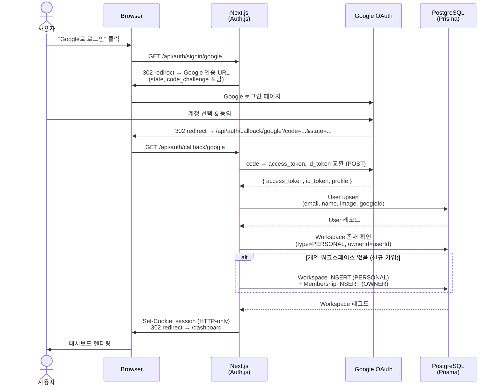
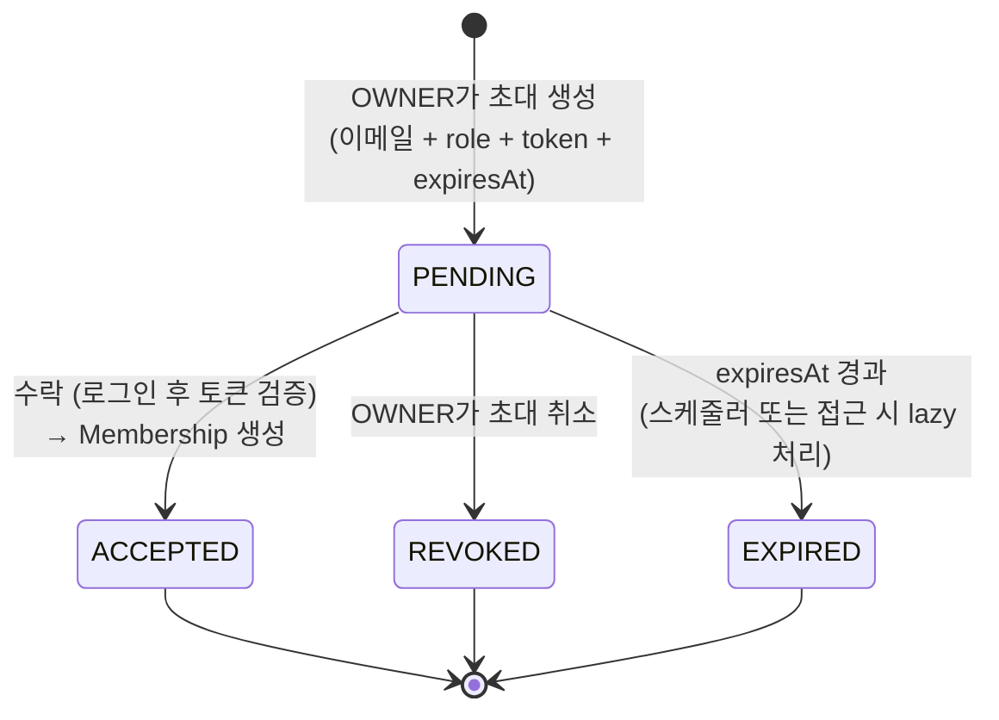

# 08 · 인증 & 권한

> **관련 문서**: [아키텍처](./04-architecture.md) · [데이터 모델](./05-data-model.md) · [API & 실시간](./06-api-and-realtime.md) · [CRDT 협업](./07-collaboration-crdt.md) · [TDD 전략](./09-tdd-strategy.md)

---

## 1. Google OAuth 로그인 흐름 (Auth.js)

### 1-1. 시퀀스 다이어그램



### 1-2. User upsert 로직

```typescript
// auth.ts — Auth.js signIn / jwt 콜백
async function handleSignIn(profile: GoogleProfile): Promise<User> {
  return prisma.user.upsert({
    where:  { googleId: profile.sub },
    update: { name: profile.name, image: profile.picture, email: profile.email },
    create: {
      email:    profile.email,
      name:     profile.name,
      image:    profile.picture,
      googleId: profile.sub,
    },
  });
}

async function ensurePersonalWorkspace(userId: string): Promise<void> {
  const existing = await prisma.workspace.findFirst({
    where: { ownerId: userId, type: 'PERSONAL' },
  });
  if (existing) return;

  await prisma.workspace.create({
    data: {
      type:    'PERSONAL',
      ownerId: userId,
      memberships: { create: { userId, role: 'OWNER' } },
    },
  });
}
```

---

## 2. 세션 전략

### 2-1. JWT vs DB Session 비교

| 항목 | JWT Session | DB Session |
|------|-------------|------------|
| **저장 위치** | 암호화된 쿠키 (서버 상태 없음) | DB의 Session 테이블 + 세션 ID 쿠키 |
| **검증 방법** | 쿠키 복호화 (매 요청 DB 조회 없음) | DB에서 세션 ID 조회 |
| **즉시 무효화** | 불가 (만료 전까지 유효) | 가능 (DB 레코드 삭제) |
| **수평 확장** | 쉬움 (stateless) | DB 공유 필요 |
| **구현 복잡도** | 낮음 | 중간 |

### 2-2. 권고: JWT Session

**이유**:

1. **MVP 단계의 단순성**: DB Session은 Session 테이블 관리·TTL 청소 작업이 추가로 필요하다.
2. **수평 확장 친화적**: 별도 Node 실시간 서버도 동일한 JWT 시크릿으로 토큰을 검증할 수 있다.
3. **즉시 무효화 불필요**: Ieum MVP에서 강제 로그아웃 시나리오(어드민 계정 정지 등)는 post-MVP 요구사항이다.

**설정**:

```typescript
// auth.ts
export const authConfig: NextAuthConfig = {
  providers: [GoogleProvider({ clientId, clientSecret })],
  session:   { strategy: 'jwt', maxAge: 30 * 24 * 60 * 60 }, // 30일
  callbacks: {
    jwt({ token, user }) {
      if (user) token.userId = user.id;
      return token;
    },
    session({ session, token }) {
      session.user.id = token.userId as string;
      return session;
    },
  },
};
```

### 2-3. 보호 라우트 — 미들웨어

```typescript
// middleware.ts (Next.js Edge Runtime)
export { auth as middleware } from '@/auth';

export const config = {
  matcher: [
    '/((?!api/auth|_next/static|_next/image|favicon.ico|login).*)',
  ],
};
```

- 미인증 요청은 `/login`으로 redirect한다.
- `api/auth/*` 경로는 Auth.js가 직접 처리하므로 미들웨어 제외.
- Route Handler 내부에서도 `auth()` 헬퍼로 이중 검증한다.

```typescript
// Route Handler 내 세션 검증 패턴
import { auth } from '@/auth';

export async function GET(req: Request) {
  const session = await auth();
  if (!session?.user?.id) return new Response(null, { status: 401 });
  // ...
}
```

---

## 3. 권한 모델

### 3-1. 역할 정의

| 역할 | 컨텍스트 | 설명 |
|------|----------|------|
| **개인 소유자** | 개인 워크스페이스 | 해당 워크스페이스의 유일한 접근자. 멤버십 테이블에 OWNER로 저장 |
| **OWNER** | 공유 워크스페이스 | 워크스페이스 **관리자**(admin). 생성자가 기본 OWNER이며, 구조 변경·삭제·멤버 관리 권한 전담 |
| **MEMBER** | 공유 워크스페이스 | 초대받은 협업자. 페이지 열람·편집 가능. 워크스페이스 구조 변경 불가 |
| **Viewer** | *(post-MVP)* | 읽기 전용. MVP에서는 구현하지 않음 |

### 3-2. 권한 매트릭스

#### 워크스페이스 리소스

| 액션 | 개인 소유자 | OWNER | MEMBER |
|------|:-----------:|:-----:|:------:|
| 워크스페이스 정보 조회 | ✅ | ✅ | ✅ |
| 워크스페이스 이름 수정 | ✅ | ✅ | ❌ |
| 워크스페이스 삭제 | ✅ | ✅ | ❌ |
| 멤버 목록 조회 | ✅ | ✅ | ✅ |
| 멤버 초대 (Invitation 생성) | ❌ | ✅ | ❌ |
| 멤버 제거 | ❌ | ✅ | ❌ |
| 멤버 역할 변경 | ❌ | ✅ | ❌ |
| 스스로 워크스페이스 나가기 | N/A | ✅¹ | ✅ |

> ¹ 마지막 OWNER는 다른 OWNER를 지정하지 않으면 나갈 수 없다.

#### 페이지 리소스

| 액션 | 개인 소유자 | OWNER | MEMBER |
|------|:-----------:|:-----:|:------:|
| 페이지 목록 조회 | ✅ | ✅ | ✅ |
| 페이지 내용 조회 | ✅ | ✅ | ✅ |
| 페이지 생성 | ✅ | ✅ | ✅ |
| 페이지 내용 편집 | ✅ | ✅ | ✅ |
| 페이지 이름·위치 변경 | ✅ | ✅ | ✅ |
| 페이지 삭제 | ✅ | ✅ | ✅² |
| 페이지별 공유 설정 | ❌ | *(post-MVP)* | *(post-MVP)* |

> ² MVP에서는 워크스페이스 멤버십 상속. 페이지별 세밀한 권한은 post-MVP.

#### 초대(Invitation) 리소스

| 액션 | 개인 소유자 | OWNER | MEMBER |
|------|:-----------:|:-----:|:------:|
| 초대 생성 | ❌ | ✅ | ❌ |
| 초대 목록 조회 | ❌ | ✅ | ❌ |
| 초대 취소(REVOKE) | ❌ | ✅ | ❌ |
| 초대 수락 | N/A | N/A | 초대받은 본인만 |

---

## 4. 권한 검사 위치

### 4-1. Route Handler — 진입 시 검증

모든 Route Handler는 **세션 인증 → 리소스 소속 확인 → 역할 비교** 순서로 검증한다.

```typescript
// 권한 검사 헬퍼 패턴
async function requireWorkspaceMember(
  userId: string,
  workspaceId: string,
  requiredRole?: 'OWNER',
): Promise<Membership> {
  const membership = await prisma.membership.findUnique({
    where: { userId_workspaceId: { userId, workspaceId } },
  });

  if (!membership) throw new ForbiddenError('워크스페이스 멤버가 아닙니다.');
  if (requiredRole && membership.role !== requiredRole) {
    throw new ForbiddenError('OWNER 권한이 필요합니다.');
  }
  return membership;
}

// 페이지 접근: 페이지 → 워크스페이스 멤버십 확인
async function requirePageAccess(userId: string, pageId: string): Promise<void> {
  const page = await prisma.page.findUnique({
    where:  { id: pageId },
    select: { workspaceId: true },
  });
  if (!page) throw new NotFoundError('페이지를 찾을 수 없습니다.');
  await requireWorkspaceMember(userId, page.workspaceId);
}
```

### 4-2. 실시간 서버 — WebSocket 연결 및 메시지 처리 시 인가

```
클라이언트 WebSocket 연결 요청
  │  ws://realtime-server/pages/:pageId
  │  헤더: Cookie (세션 쿠키) 또는 Query: ?token=<JWT>
  ▼
[연결 시 1회 검증]
  1. JWT 추출 및 서명 검증 (AUTH_SECRET 공유)
  2. userId 확인
  3. pageId → workspaceId 조회 (DB)
  4. Membership 확인 → 없으면 ws.close(4003, 'Forbidden')
  5. 통과 시 roomMap에 (pageId, userId) 등록
  │
  ▼
[메시지 수신 시 검증]
  - 인바운드 op는 인증된 연결을 통해서만 수신 (연결 시 1회 JWT 검증으로 신원 확정)
  - 서버가 연결 컨텍스트의 userId를 op에 태깅/기록 (클라이언트 전달 siteId·userId는 신원 판단에 사용 금지)
  - siteId는 CRDT 세션/탭 구분용 UUID로만 활용; siteId === userId 동일성 비교 불필요
```

```typescript
// 실시간 서버 — 연결 핸들러 (의사코드)
wss.on('connection', async (ws, req) => {
  const token   = extractToken(req); // Cookie 또는 Query
  const payload = verifyJwt(token, process.env.AUTH_SECRET);
  if (!payload) return ws.close(4001, 'Unauthorized');

  const { pageId } = parseUrl(req.url);
  const page = await db.page.findUnique({ where: { id: pageId }, select: { workspaceId: true } });
  if (!page) return ws.close(4004, 'Not Found');

  const membership = await db.membership.findUnique({
    where: { userId_workspaceId: { userId: payload.userId, workspaceId: page.workspaceId } },
  });
  if (!membership) return ws.close(4003, 'Forbidden');

  registerConnection(pageId, payload.userId, ws);

  ws.on('message', (raw) => {
    const msg = parseMessage(raw);
    if (msg.type === 'op') {
      // 신원은 연결 인증의 userId로 확정 — 클라이언트 siteId를 userId와 비교하지 않음
      // siteId는 세션/탭별 UUID이므로 그대로 유지하고, 서버가 userId를 op에 태깅
      const taggedOp = { ...msg.op, _userId: payload.userId };
      broadcast(pageId, msg, ws); // 발신자 제외 브로드캐스트
      persistOp(pageId, taggedOp);
    }
  });
});
```

---

## 5. 초대 흐름

### 5-1. 상태 전이 다이어그램



### 5-2. 초대 생성

```typescript
// POST /api/workspaces/:workspaceId/invitations
async function createInvitation(
  invitedById: string,
  workspaceId: string,
  body: { email: string; role: 'OWNER' | 'MEMBER' },
): Promise<Invitation> {
  // 1. 호출자가 OWNER인지 확인
  await requireWorkspaceMember(invitedById, workspaceId, 'OWNER');

  // 2. 이미 멤버인지 확인
  const target = await prisma.user.findUnique({ where: { email: body.email } });
  if (target) {
    const existing = await prisma.membership.findUnique({
      where: { userId_workspaceId: { userId: target.id, workspaceId } },
    });
    if (existing) throw new ConflictError('이미 워크스페이스 멤버입니다.');
  }

  // 3. 기존 PENDING 초대가 있으면 REVOKE 후 재생성 (중복 방지)
  await prisma.invitation.updateMany({
    where:  { email: body.email, workspaceId, status: 'PENDING' },
    data:   { status: 'REVOKED' },
  });

  // 4. 새 초대 생성
  const token = crypto.randomBytes(32).toString('hex'); // 256-bit 무작위 토큰
  const invitation = await prisma.invitation.create({
    data: {
      email:       body.email,
      workspaceId,
      invitedById,
      role:        body.role,
      token,
      status:     'PENDING',
      expiresAt:  new Date(Date.now() + 7 * 24 * 60 * 60 * 1000), // 7일
    },
  });

  // 5. 초대 이메일 발송 (Resend)
  try {
    await sendInvitationEmail({
      to: body.email,
      inviteUrl: `${APP_URL}/invite/accept?token=${token}`,
      workspaceName,
    });
  } catch (e) {
    // 발송 실패해도 초대는 PENDING으로 유지 → OWNER가 링크를 수동 복사/전달 가능 (fallback)
    logger.warn('invitation email send failed', e);
  }
  return invitation;
}
```

### 5-3. 초대 수락

```typescript
// POST /api/invitations/accept  { token: string }
async function acceptInvitation(userId: string, token: string): Promise<void> {
  // 1. 토큰으로 초대 조회
  const invitation = await prisma.invitation.findUnique({ where: { token } });
  if (!invitation)                           throw new NotFoundError('유효하지 않은 초대입니다.');
  if (invitation.status !== 'PENDING')       throw new BadRequestError(`초대 상태: ${invitation.status}`);
  if (invitation.expiresAt < new Date())     throw new BadRequestError('만료된 초대입니다.');

  // 2. 수락하는 사용자의 이메일이 초대 이메일과 일치하는지 확인
  const user = await prisma.user.findUnique({ where: { id: userId } });
  if (user?.email !== invitation.email)      throw new ForbiddenError('초대받은 이메일과 다릅니다.');

  // 3. 이미 멤버 처리 (동시 수락 경쟁 방지)
  await prisma.$transaction(async (tx) => {
    const existing = await tx.membership.findUnique({
      where: { userId_workspaceId: { userId, workspaceId: invitation.workspaceId } },
    });
    if (existing) throw new ConflictError('이미 멤버입니다.');

    await tx.membership.create({
      data: { userId, workspaceId: invitation.workspaceId, role: invitation.role },
    });
    await tx.invitation.update({
      where: { id: invitation.id },
      data:  { status: 'ACCEPTED' },
    });
  });
}
```

### 5-4. 초대 취소 및 만료 처리

```typescript
// DELETE /api/workspaces/:workspaceId/invitations/:invitationId
async function revokeInvitation(
  userId: string,
  workspaceId: string,
  invitationId: string,
): Promise<void> {
  await requireWorkspaceMember(userId, workspaceId, 'OWNER');
  await prisma.invitation.updateMany({
    where: { id: invitationId, workspaceId, status: 'PENDING' },
    data:  { status: 'REVOKED' },
  });
}

// 만료 처리: lazy (초대 수락 시 expiresAt 검사) + 스케줄러 병행
// 스케줄러 (일 1회): PENDING & expiresAt < NOW → EXPIRED 일괄 처리
```

---

## 6. 보안 고려사항

### 6-1. 토큰 추측 방지

| 항목 | 조치 |
|------|------|
| **토큰 엔트로피** | `crypto.randomBytes(32)` → 256-bit. 브루트포스 불가 |
| **토큰 노출 최소화** | DB에 평문 저장하되 URL에만 사용. 이메일 링크 외 노출 금지 |
| **단일 사용** | 수락 즉시 `status: 'ACCEPTED'`로 전환. 재사용 불가 |
| **만료** | 7일 후 `EXPIRED`. lazy 처리 + 스케줄러 병행 |

### 6-2. 초대 이메일 발송 실패 처리 (fallback)

Resend 발송 실패 시 초대는 PENDING 상태로 유지된다. OWNER는 `GET /api/invitations/:token` 공개 조회 엔드포인트로 초대 링크를 확인한 뒤 직접 복사해 피초대자에게 전달할 수 있다.

### 6-3. 이미 멤버인 경우

- 초대 생성 시: 대상 이메일이 이미 해당 워크스페이스 멤버이면 `409 Conflict` 반환.
- 초대 수락 시: DB 트랜잭션 내에서 Membership 존재 여부를 재확인하여 경쟁 조건(race condition) 방지.

### 6-4. 권한 상승 방지

| 시나리오 | 대응 |
|----------|------|
| MEMBER가 초대 생성 시도 | Route Handler에서 `requireWorkspaceMember(..., 'OWNER')` → 403 |
| MEMBER가 다른 멤버 제거 시도 | 동일하게 OWNER 검증 → 403 |
| OWNER가 초대 시 role을 임의 값으로 전달 | `role: z.enum(['OWNER', 'MEMBER'])` Zod 스키마 검증 |
| 초대 이메일과 다른 계정으로 수락 시도 | `user.email !== invitation.email` 검사 → 403 |

### 6-5. WebSocket 메시지 위변조 방지

| 위험 | 대응 |
|------|------|
| 클라이언트가 타인 userId를 siteId에 넣어 op 전송 | 신원은 연결 인증의 userId로 판단, op엔 서버가 userId 태깅 → 클라이언트 siteId 위조는 무의미 |
| 연결 유지 중 멤버십 제거 | 멤버 제거 API 호출 시 해당 userId의 ws 연결을 강제 종료 (`ws.close(4003)`) |
| 만료된 JWT로 ws 재연결 시도 | `verifyJwt` 실패 → `ws.close(4001)`. Auth.js maxAge와 동일한 만료 정책 적용 |
| ws 페이로드 크기 폭탄 | 메시지 크기 상한 설정 (예: 64KB). 초과 시 연결 종료 |

### 6-6. 세션 보안

| 항목 | 설정 |
|------|------|
| **쿠키 속성** | `HttpOnly: true`, `Secure: true` (HTTPS), `SameSite: lax` |
| **JWT 서명** | `HS256` with `AUTH_SECRET` (32바이트 이상 무작위 문자열) |
| **JWT 만료** | 30일. Refresh Token 없음 (재로그인으로 갱신) |
| **CSRF** | SameSite=lax + Auth.js 내장 CSRF 토큰으로 대응 |
